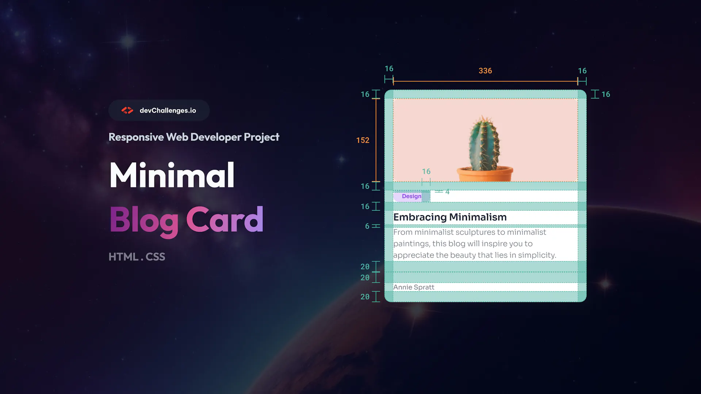

<h1>Minimal Blog Card</h1>

This challenge is a great way to start with basic HTML and CSS skills. The challenge is to create a simple blog card that includes an image, a title, a short description, and a tag.

